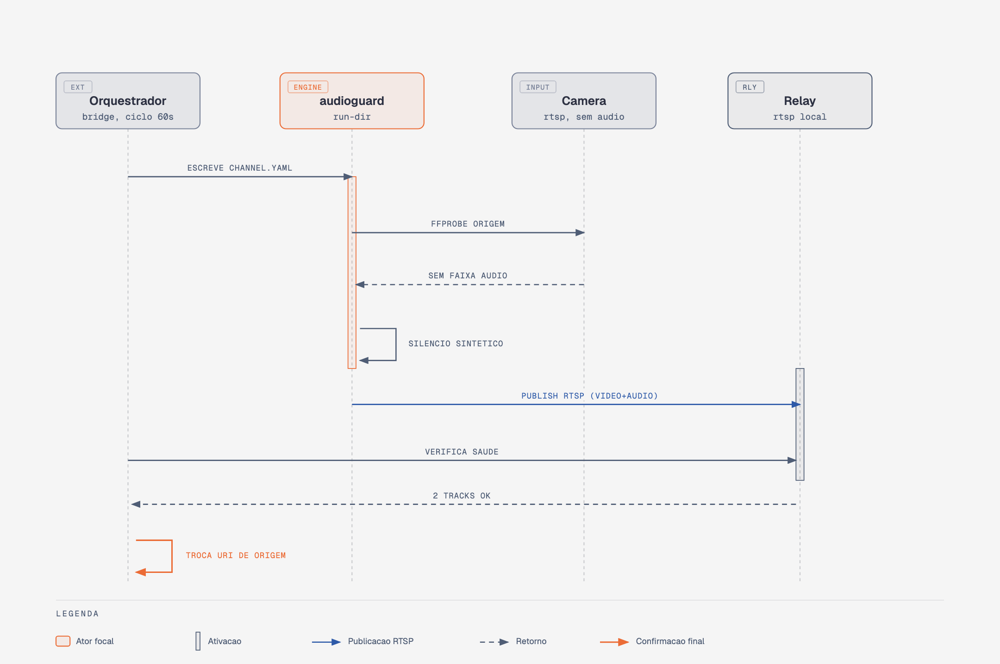

# Integrações

O `audioguard` é agnóstico de quem gera os arquivos de config em `CHANNELS_DIR` — ele só lê `*.yaml`/`*.yml` desse diretório (ver `cli.py::cmd_run_dir`). Isso permite integrações externas escreverem configs automaticamente sem o `audioguard` precisar saber nada sobre elas.

## Referência real: bridge de orquestrador

Existe uma integração real em produção (fora deste repo, código privado, específico de uma stack fechada) seguindo o padrão abaixo. Documentado aqui como referência de contrato — se você for integrar `audioguard` com o seu próprio orquestrador, esse é o padrão validado.

### O que ele resolve

Um orquestrador de canais já sabe, por canal, se existe uma faixa de áudio real configurada na origem (ex.: via algum campo de bitrate por pipe/track). A integração usa isso pra rodar `audioguard` **só** nos canais que têm vídeo mas não têm áudio — os demais continuam no pipeline normal, sem nunca passar pelo `audioguard`.

### Fluxo (usa `output.mode: publish`, não `hls`)

```
câmera sem áudio --RTSP--> audioguard --publish RTSP--> [origem do canal no orquestrador]
```

Em vez do `audioguard` servir HLS final pro cliente, ele vira uma **fonte substituta**: publica RTSP corrigido (vídeo real + áudio, sintético ou passthrough) pra um relay local, e o bridge troca a URL de origem do canal no orquestrador pra apontar pra esse relay em vez da câmera direto. O resto do pipeline (packager, DRM, entrega) nunca fica sabendo que o `audioguard` existe.

{ .arch-diagram }

Passo a passo do ciclo (roda a cada 60s via systemd timer):

1. Consulta o orquestrador: quais canais têm vídeo mas não têm áudio configurado.
2. Pra cada um, escreve `<CHANNELS_DIR>/<id>.yaml` com `output.mode: publish` e `output.publish_url` apontando pro relay local (ex.: `rtsp://127.0.0.1:8554/audioguard_<id>`).
3. Reinicia a unit `audioguard.service` (`run-dir` não tem hot-reload — ver "Limitações" abaixo).
4. **Só depois** de confirmar via `ffprobe` que a publicação está de pé (vídeo + áudio presentes na saída), troca a URL de origem do canal no orquestrador. Enquanto não confirma, a origem original continua intacta — nunca troca "no escuro".
5. Guarda estado local (qual canal foi trocado, qual era a URL original) pra poder reverter depois.
6. A cada ciclo, reprova a URL **original** da câmera (não a do `audioguard`) — se ela recuperou áudio de verdade, reverte a troca e libera o canal do `audioguard`.

### Armadilhas reais encontradas implementando isso

Deixadas aqui porque qualquer bridge parecido vai tropeçar nas mesmas:

1. **Reversão pode ser desfeita no mesmo ciclo.** Se o passo de detecção (passo 1) roda de novo depois da reversão (passo 6), sem uma trava ele recria a config na hora — porque nada mudou na configuração declarada do canal, só a origem real recuperou áudio. Fix: marcar o canal como "acabou de reverter" e pular a re-detecção só nesse ciclo.
2. **Reversão pode ser desfeita no ciclo seguinte.** Se o sinal de detecção (ex.: `abitrate` configurado por pipe) é um valor estático que só um admin muda manualmente — não uma leitura ao vivo da origem — ele continua "sem áudio" pra sempre, mesmo depois da reversão. Sem tratamento, o próximo ciclo detecta de novo e desfaz a reversão. Fix: cooldown persistente (ex.: 1h) depois de reverter, antes do canal poder voltar a se candidatar.
3. **Trocar só a URL de origem não é suficiente pro player final tocar.** Esse foi o mais caro de descobrir. Um orquestrador de canais tipicamente guarda **dois tipos de estado separados** sobre áudio, e trocar a URL só afeta os bytes que chegam — nenhum dos dois se atualiza sozinho:
   - **Config de bitrate/encode por rendition** (ex.: campo `abitrate` de um "pipe"/perfil) — é isso que o gerador de manifest HLS usa pra decidir se anuncia uma faixa de áudio (`#EXT-X-MEDIA:TYPE=AUDIO` + atributo `AUDIO="..."` no `#EXT-X-STREAM-INF`). Fica em 0 pra sempre se ninguém setar.
   - **Mapeamento explícito entrada→rendition** (ex.: um campo tipo `aslot`, lista de quais renditions aquele stream de entrada alimenta) — é isso que diz ao packetizer *que* esse stream específico tem uma faixa de áudio pra extrair. Canal que nasceu sem áudio tem esse campo vazio pra sempre, mesmo que os bytes que chegam agora carreguem áudio de verdade.

   Sintoma no cliente: o manifest HLS carrega (200 OK, formato válido), mas o player recusa tocar com erro genérico tipo "invalid or corrupt playlist" — porque o manifest gerado é **estruturalmente diferente** do de um canal que sempre teve áudio (uma única rendition combinada em vez de duas renditions separadas, vídeo e áudio, referenciadas via grupo). Comparar byte a byte o manifest de um canal que já funciona com o do canal corrigido é o jeito mais rápido de achar a diferença — não dá pra adivinhar isso sem ver os dois lado a lado.

   Fix: depois de confirmar a troca de origem, o bridge também precisa fazer as duas escritas de config acima (bitrate > 0 no pipe, e o mapeamento de rendition incluindo esse stream) — normalmente 1-2 chamadas de API adicionais no orquestrador, além da troca de URL.

4. **Nem todo endpoint da API do orquestrador resolve identificador amigável (uid/slug) do mesmo jeito.** Um endpoint pode aceitar tanto `id` numérico quanto `uid`/slug pra achar o recurso; o endpoint vizinho, que parece fazer a mesma coisa, pode só aceitar o `id` numérico e falhar silenciosamente (retornar lista vazia) ou com erro 500 se receber o slug. Não assuma que a API é consistente entre endpoints só porque a URL tem o mesmo formato — testa cada endpoint isolado antes de generalizar.

### Convenção de nomeação

Nomeie a unit systemd do `audioguard` como `audioguard.service` — é o nome que um bridge típico assume ao chamar `systemctl restart`.

### Isolamento seguro

Um bridge externo nunca deve apagar um `.yaml` que não foi ele quem criou. Marque os arquivos gerados com uma linha de comentário fixa no topo (ex.: `# gerado por <nome-do-bridge> - nao editar a mao`) e, ao decidir o que remover, só considere arquivos com essa marca. Mesma lógica vale pro estado: nunca reverta uma troca de origem que não está registrada no seu próprio arquivo de estado — pode ter sido feita por outra ferramenta.

## Limitações atuais

- **Sem hot-reload.** `run-dir` lê `CHANNELS_DIR` uma única vez, na subida do processo. Uma integração externa que adiciona/remove canais precisa reiniciar o `audioguard` pra aplicar a mudança (ver `supervisor.py`/`cli.py` — nenhum deles observa o diretório continuamente ainda).
- **Nenhuma API externa própria.** `audioguard` não expõe HTTP/RPC pra outros sistemas consultarem estado — integrações são unidirecionais (escrevem config, o `audioguard` só lê).

Essas duas limitações são candidatas naturais pra v0.2 se o padrão de integração externa se confirmar necessário (watch no diretório + reload gracioso, em vez de restart completo do processo).
