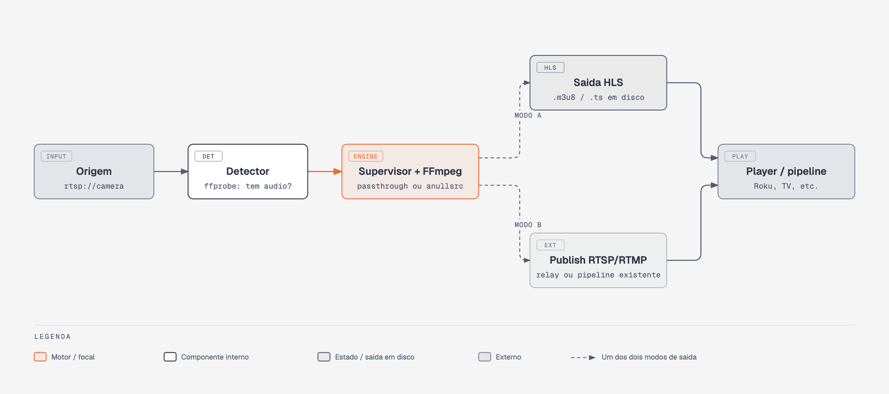

# audioguard

Serviço open-source, single-purpose: recebe um stream de entrada e garante que a saída sempre tenha uma faixa de áudio válida — real, quando existe na origem, ou silenciosa sintética, quando não existe — entregando HLS pronto para qualquer player, incluindo Roku.

Protocolo de origem suportado hoje: **RTSP**. A arquitetura é pensada desde o início para outros protocolos (RTMP, SRT, HLS) entrarem sem alterar o restante do sistema — ver [Fontes / protocolos](SOURCES.md).

## O problema

Vários players de TV/streaming — a especificação da Roku é explícita nisso — assumem que todo stream de vídeo carrega uma faixa AAC estéreo. Quando a origem é vídeo puro (câmera sem microfone, rádio recodificado, feed institucional), o player trava, não inicia, ou simplesmente recusa reproduzir a mídia, muitas vezes sem nenhum erro visível no manifest.

!!! note "Causa raiz"
    Não é o manifest (`#EXT-X-STREAM-INF` sem `AUDIO="..."`). É a ausência real de um PID de áudio decodificável no stream. Não existe correção de metadado para isso — precisa haver, de fato, uma faixa de áudio codificada saindo do processo, mesmo que o conteúdo dela seja silêncio.

## Arquitetura, em uma imagem

{ .arch-diagram }

Um processo FFmpeg supervisionado por canal. `Detector` decide, via `ffprobe`, se a origem já carrega áudio; `Supervisor + FFmpeg` aplica o caso correto (passthrough sem reencode, ou síntese de silêncio) e entrega o resultado em um de dois modos de saída — arquivo HLS estático em disco, ou publicação RTSP/RTMP para um relay. Detalhe completo em [Arquitetura](ARCHITECTURE.md).

## Os dois casos

=== "Origem já tem áudio"

    ```bash
    ffmpeg -i "rtsp://origem/canal" \
      -c:v copy -c:a copy \
      -f hls -hls_time 4 -hls_list_size 6 \
      -hls_segment_type mpegts \
      -hls_flags delete_segments+independent_segments \
      /saida/canal/index.m3u8
    ```

    `-c:v copy` e `-c:a copy`: sem reencode, nem de vídeo nem de áudio — zero perda em relação à origem, CPU baixíssima. Apenas remuxa.

=== "Origem só tem vídeo"

    ```bash
    ffmpeg -i "rtsp://origem/canal" \
      -f lavfi -i anullsrc=channel_layout=stereo:sample_rate=48000 \
      -map 0:v -map 1:a \
      -c:v copy -c:a aac -b:a 32k -shortest \
      -f hls -hls_time 4 -hls_list_size 6 \
      -hls_segment_type mpegts \
      -hls_flags delete_segments+independent_segments \
      /saida/canal/index.m3u8
    ```

    Vídeo continua em `copy` (zero perda). Apenas o áudio silencioso é codificado — custo de CPU desprezível (poucos kbps, sinal constante zero).

`audioguard` decide sozinho qual dos dois casos aplicar, rodando `ffprobe` na origem antes de subir o processo — sem configuração manual por canal.

## Início rápido

!!! tip ".deb (recomendado, Debian/Ubuntu)"
    Instala como serviço, resolve `ffmpeg` sozinho via `apt`, e já traz um relay RTSP embutido (`audioguard-relay`, baseado em [MediaMTX](https://github.com/bluenviron/mediamtx)) escutando em `127.0.0.1:8554` — o modo de publicação funciona de imediato, sem infraestrutura externa.

    ```bash
    sudo apt install ./audioguard-focal.deb   # troque focal por noble ou 26.04 conforme sua distro
    # adicione um channel.yaml em /etc/audioguard/channels/, depois:
    sudo systemctl start audioguard
    ```

Guia completo, incluindo binário solto e instalação a partir do código-fonte, em [Uso](USAGE.md).

## Por que não usar um relay RTSP intermediário na entrada

FFmpeg consome a maioria dos protocolos de origem nativamente (RTSP, RTMP, HTTP-HLS, SRT quando compilado com `--enable-libsrt`) e entrega HLS de saída em um único processo. Cada camada intermediária adicional representa mais latência, mais um ponto de falha e — se reencodar no meio do caminho — perda de qualidade. `audioguard` só introduz um hop de relay separado quando a origem exige isso explicitamente.

## Status

Alpha. Implementação funcional e testada — 15 testes unitários, validação end-to-end real com `ffmpeg`/`ffprobe`, empacotamento `.deb` testado com instalação real em container Ubuntu limpo. Binários pré-compilados disponíveis em [Releases](https://github.com/FernandoHaeser/audioguard/releases) para `focal` (20.04), `noble` (24.04) e `26.04`.

## Licença

MIT — ver [`LICENSE`](https://github.com/FernandoHaeser/audioguard/blob/develop/LICENSE).
